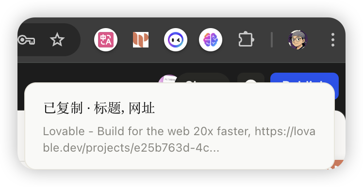
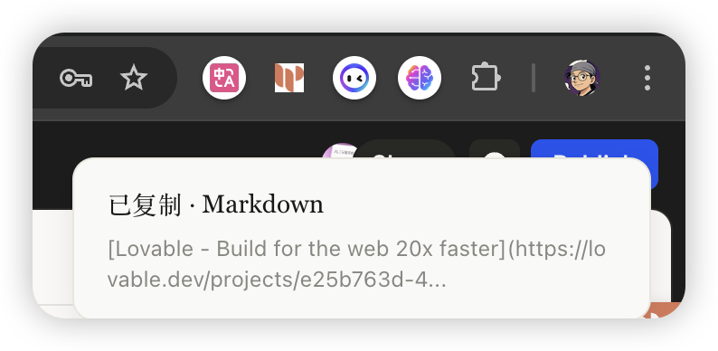
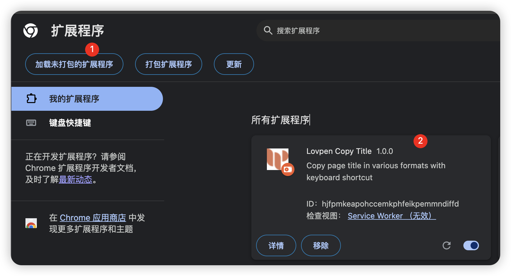
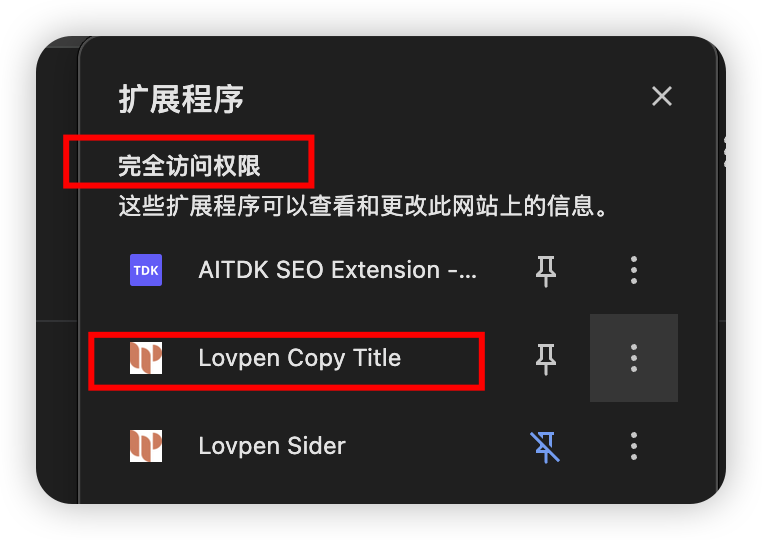

# Better Copy Title And Link

一键复制网页标题和链接，支持多种格式和快捷键。

## 功能特性

- **多种格式**: 纯网址、纯标题、标题+网址、Markdown 链接、自定义模板
- **快捷键**: `⌘K` 复制标题+网址，`⌘⇧K` 复制 Markdown 格式
- **自定义模板**: 使用 `{title}` 和 `{url}` 占位符定义格式

## cmd+K 复制标题格式效果



## cmd+shift+K 复制 Markdown 格式效果



## 本地安装插件

```bash
pnpm install
pnpm build
```

1. 打开 `chrome://extensions/`，开启「开发者模式」
2. 点击「加载已解压的扩展程序」，选择 `dist/` 目录



## 建议完全访问权限

将扩展设置为「完全访问权限」以确保快捷键在所有页面生效。



## 自定义快捷键

`chrome://extensions/shortcuts`

## License

MIT
